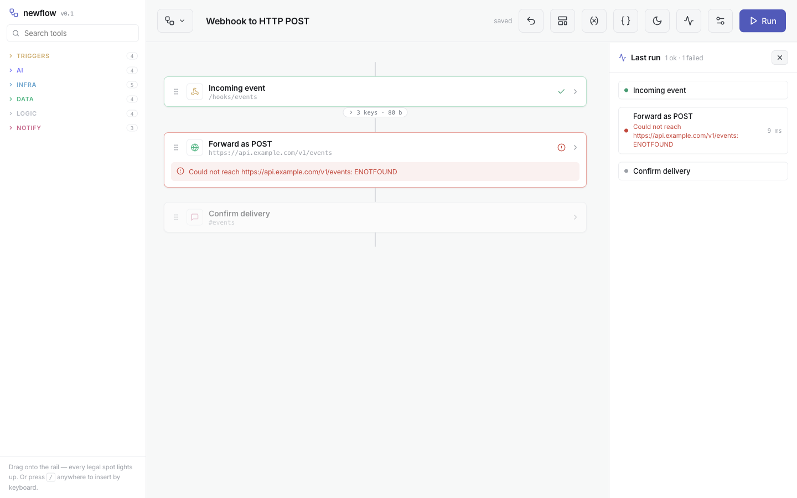
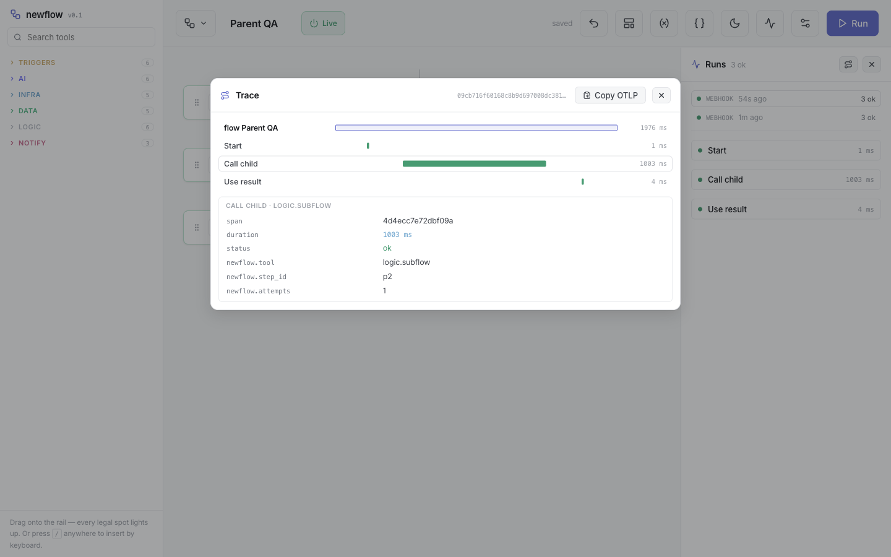
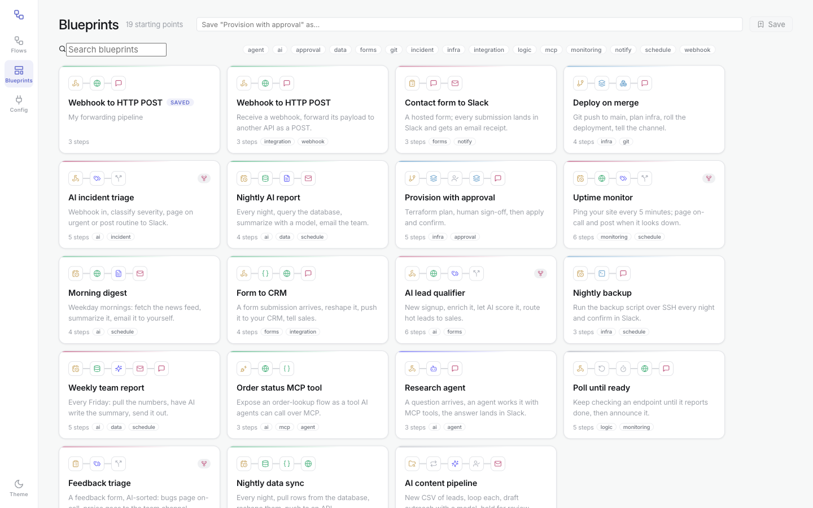

<p align="center">
  
</p>

<p align="center">
  <strong>Workflow orchestration with no canvas, no wires, and no mocks.</strong><br/>
  A rail instead of a graph. LLM-native to the core. Small enough to read in an afternoon.
</p>

<p align="center">
  
  
  
  
  
  
</p>

---

Every workflow tool since Node-RED hands you the same thing: a freeform canvas, a bag of nodes, and a wiring job. The canvas is where the pain lives — spaghetti edges, manual layout, hunting for the failing node, config modals that hide your flow.

**steprail deletes the canvas.** A flow is a vertical rail. Drag a tool and every legal insertion point lights up; drop it and it's wired — miswiring is impossible by construction. Branches fork into parallel lanes that visibly merge back. Config expands in place. Errors land on the step that caused them, in plain language. A teenager can build a real automation in two minutes; the same tool runs Terraform behind a human approval gate.

<p align="center"></p>

## Run it (one command)

Nothing to clone, no config to edit — just Docker:

```bash
curl -fsSL https://raw.githubusercontent.com/justynroberts/steprail/main/install.sh | sh
```

Fetches the project, starts steprail + a demo Postgres (pulls the prebuilt multi-arch image when available, otherwise builds), seeds the demo data, waits for health, and opens **`http://localhost:8452`**. Works on macOS and Linux (Windows via WSL). Everything after startup is set in the UI — there are no config files to hand-edit.

Prefer to drive it yourself? From a clone:

| Goal | Command |
|---|---|
| Run it (Docker) | `make up` |
| Hot-reload dev (Vite :8451 + API :8452) | `make dev` |
| Run the tests | `make test` |
| Logs · stop · wipe | `make logs` · `make down` · `make clean` |

**New here? The [User Guide](docs/USER-GUIDE.md) goes from zero to a running flow in five minutes.**

## What makes it different

**The rail — miswiring is impossible.** Insertion slots instead of wires. Deterministic auto-layout, so a flow always looks the same. Branch lanes with real routing (only the matching lane runs; an `else` lane catches the rest, or leave the key blank to fan out in parallel and merge). Config expands in place. Every payload renders as labeled key/value fields — raw JSON is a toggle, never the wall of text you start with.

**Real execution, honestly.** Runs execute server-side on a durable, file-backed event queue. HTTP calls actually go out; transforms run in a `node:vm` sandbox; AI steps call Anthropic; infra steps shell out to real `terraform` / `kubectl` / `ssh` / `ansible` / `git` / `aws` / `docker` (all bundled in the image). An unconnected step fails with *"Slack is not connected — add a connection in Secrets"* — **never a fake success.** Waits park in the queue and survive restarts. Approvals hold a run for days and resume on a click. Failures retry with backoff, visibly.

**LLM-native, both directions.** Every flow is one portable JSON object with no internal ids — an LLM can author it (a self-contained prompt ships in the app) and the editor imports it tolerantly. **StepHan**, the built-in assistant, turns a sentence into a complete, configured flow. And steprail *is an MCP server*: any flow that starts with an MCP trigger becomes a typed tool Claude Code/Desktop can call at `/mcp`. Point the **AI agent** step (a real tool-use loop) at any MCP server — including steprail's own — and flows orchestrate flows.

**Observable like production software.** Every run is an OpenTelemetry trace; every step a span with attempts, status, and events for retries and holds. Outgoing HTTP carries W3C `traceparent`. A built-in waterfall viewer answers "where did the time go", and `?format=otlp` (plus an optional collector endpoint) feeds Jaeger / Tempo / Grafana.

<p align="center"></p>

**Low-code all the way down.** Hosted forms built field-by-field, served at a live URL, each submission starting a run — and a choice field can populate its dropdown **live from any JSON API**. Schedules picked as "Weekdays at 8am", cron compiled underneath. Config values edited as key/value rows. Data tokens — `{{Step.field}}`, `{{var.*}}`, `{{config.*}}`, `{{system.*}}`, wildcards — inserted by clicking chips and resolved for real at run time.

## Tool catalog (33)

| | |
|---|---|
| **Triggers** (6) | Webhook · Form · MCP tool call · Schedule · Git push · File watch |
| **AI** (6) | LLM prompt · AI agent (MCP tool-use loop) · MCP tool · Extract (structured output) · Classify · Summarize |
| **Infra** (7) | Terraform (inline HCL or dir) · Kubernetes · Docker build · SSH · **Ansible** (inline / git playbook, inline / git inventory) · **Git** (clone · commit · push · pull · merge · tag) · Cloud function |
| **Data** (5) | HTTP request · PostgreSQL · Transform (JS) · Filter · Memory (cross-run state) |
| **Logic** (6) | Branch · Loop (per-item) · Until (repeat-until) · Run flow (subflows + passed vars) · Wait · Approval |
| **Notify** (3) | Slack · Email · PagerDuty |

**30 tagged blueprints** — each card previews its real flow as an icon chain — cover deploys, incident triage, uptime, forms-to-CRM, AI agents, Ansible fleet ops, and data sync. Adding a tool is one entry in a catalog file; adding a blueprint is one JSON object.

<p align="center"></p>

## Architecture

```
browser (React + TS, the rail)          server (single Node process)
  flows/blueprints/config pages   ──►     Express API + static
  editor: palette · rail · runs   ──►     event queue (JSON file, worker loop)
                                          real executors (fetch/vm/CLIs/MCP/AI)
  /hooks/*  /forms/*  /mcp        ──►     triggers: armed schedules, live endpoints
                                          OTel spans → viewer / OTLP export
```

One process, one data directory, one table-shaped queue with `state` and `not_before` columns — that's how waits, approvals, retries, loops, and crash recovery all work from the same mechanism. Swapping the queue file for SQLite/Postgres/Redis touches four functions. The flow model is a **tree, not a graph**: order in the array *is* the wiring, and the whole editor and engine walk the same tree. **Projects** are the tenant boundary — flows, runs, connections, and `{{config.*}}` values are strictly per-project.

Design docs: [`docs/ARCH-QUEUE.md`](docs/ARCH-QUEUE.md) · [`docs/ARCH-AI-OTEL.md`](docs/ARCH-AI-OTEL.md) · [`docs/UX-REVIEW.md`](docs/UX-REVIEW.md) · [`docs/PRD.md`](docs/PRD.md).

## Security posture

steprail is built to be exposed carefully, and the credential path is defence-in-depth:

- **Secrets are write-only and encrypted at rest.** Connections and API keys are sealed with **AES-256-GCM** (per-secret random IV); the 32-byte key comes from `STEPRAIL_ENCRYPTION_KEY` or an auto-generated `data/.encryption-key` written `0600`. Decryption happens only at the execution boundary — the browser sees `has*` flags, never a value, and secrets are redacted from run errors.
- **Strictly per-project isolation.** Secrets and config resolve per project at execution time; a flow can never read another project's connections, and subflows only call same-project flows.
- **Opt-in access token locks the whole API** (constant-time comparison), leaving `/hooks/*` open for external senders to gate by per-path secrecy.
- **CLI executors reject flag smuggling.** Step values that look like `-flags` are refused, so a `{{token}}` carrying webhook data can't inject options. `kubectl` command mode additionally refuses any flag that would redirect the cluster or credentials; the GitHub token for `git` never touches argv (it rides in a `0600` `GIT_CONFIG_GLOBAL`).
- **SSRF-hardened outbound lookups.** The one place a request URL comes from config — a form's live-dropdown API — blocks loopback/private/link-local/CGNAT/cloud-metadata targets, **pins the connection to the validated IP** (no DNS-rebinding window), refuses redirects, caps the response, and only fetches URLs already saved in a flow.
- **SSH keys and kubeconfigs** are written to `0600` temp files and cleaned up; nothing rides in the process list.

The `node:vm` sandbox and open HTTP egress from `data.http` are deliberate — the flow author is the operator. Set the access token before exposing steprail beyond your network.

## Status

Early and honest: personal / homelab-grade durability (file-backed queue, single process), **33 tools** plus anything MCP speaks, and a committed test suite (`make test` — engine unit tests plus API integration tests that boot a real server on a temp data dir). The bones — rail UX, a real queue, MCP in both directions, OTel tracing, and a hardened credential path — are the point.

MIT © fintonlabs.com
