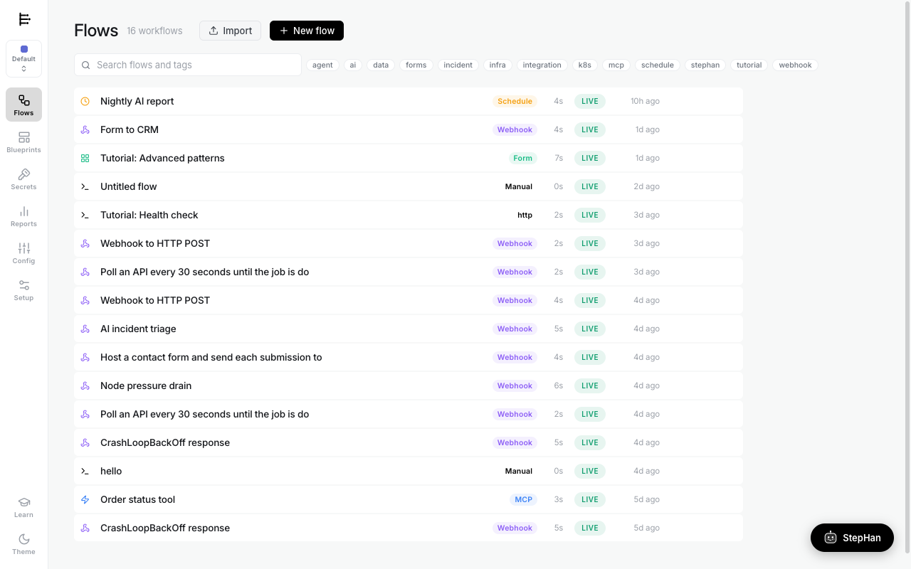
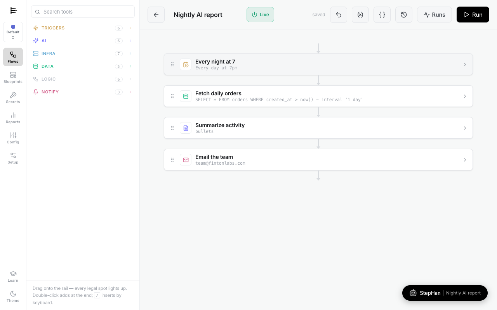
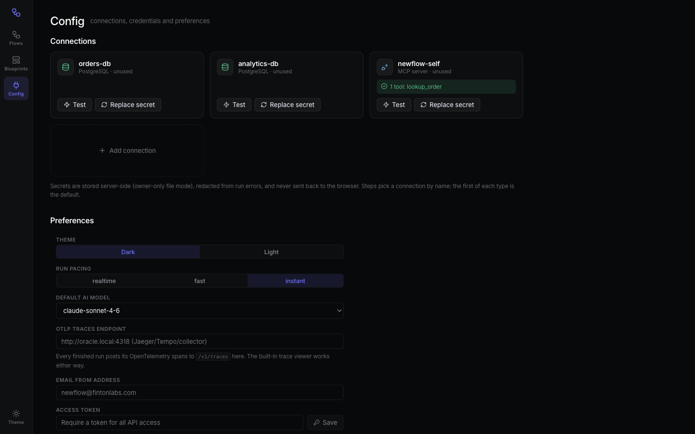
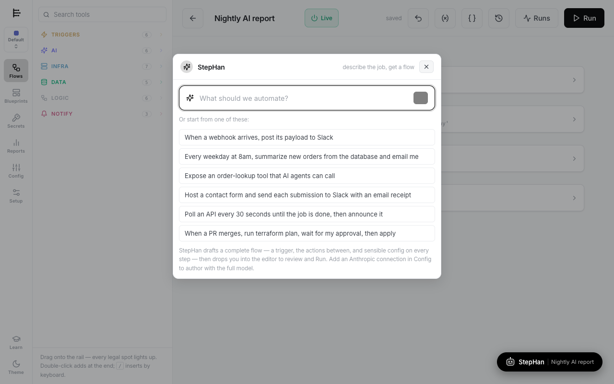
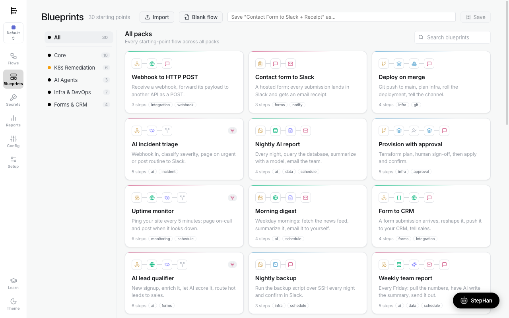
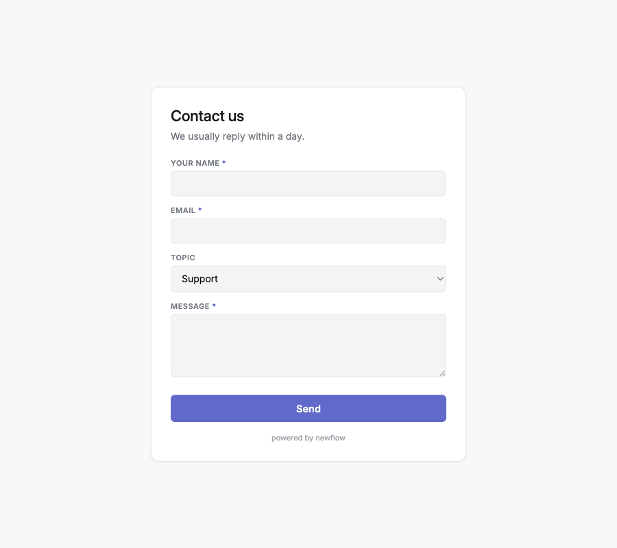

<!-- MIT License - Copyright (c) fintonlabs.com -->
# steprail — User Guide

From zero to a running workflow in about five minutes. This guide assumes nothing beyond Docker (or Node) on your machine.

- [1. Run it](#1-run-it)
- [2. The lay of the land](#2-the-lay-of-the-land)
- [3. Build your first flow](#3-build-your-first-flow-three-ways)
- [4. Connect your services](#4-connect-your-services)
- [5. Turn on StepHan (the AI author)](#5-turn-on-stephan-the-ai-author)
- [6. Run a flow and read the result](#6-run-a-flow-and-read-the-result)
- [7. Hosted forms & live dropdowns](#7-hosted-forms--live-dropdowns)
- [8. Going further](#8-going-further)
- [Troubleshooting](#troubleshooting)

---

## 1. Run it

**You need:** just **Docker** (with Compose) — macOS/Linux, or Windows via WSL2 — and ports **8451** and **8452** free. Nothing else to boot. (An Anthropic key and any service connections are optional and added later in the UI; the infra CLIs are already bundled in the image. Only *developing* steprail needs Node.js 22.)

One command, nothing to clone or configure — just Docker:

```bash
curl -fsSL https://raw.githubusercontent.com/justynroberts/steprail/main/install.sh | sh
```

It fetches the project, starts steprail + a demo Postgres, seeds the demo data, waits for health, and opens **http://localhost:8452**. That's it.

Working from a clone instead? `make up` does exactly the same.

| Want to… | Run |
|---|---|
| Stop it (keep data) | `make down` |
| Hot-reload dev mode | `make dev` — client on `:8451`, API on `:8452` |
| Follow logs | `make logs` |
| Run the tests | `make test` |
| Wipe containers **and** data | `make clean` |
| See every target | `make help` |

No `make`? `docker compose up --build -d`, then `make seed` to load the demo Postgres. Everything else in the app is configured through the UI — there are no config files to edit.

Self-hosting for a team (persistence, TLS, the production checklist, publishing your own image)? See the **[Deploy Guide](DEPLOY.md)**.

---

## 2. The lay of the land

The left rail is the whole app:

- **Flows** — your workflows. Toggle any one **Live/Off** in place, duplicate it, export it.
- **Blueprints** — 30 ready-made starting points, grouped into packs. Each card previews its real step chain.
- **Secrets** — your connections (databases, Slack, SSH keys, API tokens). Write-only and encrypted.
- **Config** — per-project values your flows read as `{{config.*}}`.
- **Reports** — run history and OpenTelemetry traces.
- **Setup** — server info, the StepHan AI key, failure alerts, theme, and white-label branding.

<p align="center"></p>

Everything is scoped to a **Project** (the switcher at the top-left). Secrets and config are strictly per-project — a good way to keep dev, staging, and prod apart.

---

## 3. Build your first flow (three ways)

Open any flow (or press **New flow**) and you're in the editor. A flow is a **vertical rail**, not a canvas — order is the wiring, and there are no lines to draw.

<p align="center"></p>

**a) From a blueprint (fastest).** Blueprints → pick a card → it opens as an editable flow. Great for learning the shape of a real automation.

**b) By hand.** Drag a tool from the left palette onto the rail — every legal insertion point lights up, so you can't miswire. Every flow starts with a **trigger** (webhook, schedule, form, git push, file watch, or an MCP tool call), then actions flow top-to-bottom. Click any step to configure it in place; a branching step forks into parallel lanes that visibly merge back.

**c) With StepHan.** Describe the job in a sentence and let the AI draft the whole thing (see §5).

Wire data between steps with **tokens**: `{{Fetch orders.rows}}` pulls an earlier step's output into any field. Click the `{ }` toolbar button to browse every available token.

---

## 4. Connect your services

Steps that touch the outside world (Slack, Postgres, SSH, an LLM…) need a **connection**. steprail never fakes success — an unconnected step fails with a plain message like *"Slack is not connected — add a connection in Secrets."*

Go to **Secrets → add a connection**, choose the type, give it a name, paste the credential. Secrets are **write-only**: encrypted at rest, never sent back to the browser, and redacted from error messages. A step either uses your project's default connection of that type, or you name a specific one.

<p align="center"></p>

> **Tip:** name an SSH connection after a hostname and the SSH/Ansible steps will use it for that host automatically — mixed fleets, zero extra config.

---

## 5. Turn on StepHan (the AI author)

StepHan drafts a complete, runnable flow — trigger, actions, and sensible config on every step — from one sentence.

<p align="center"></p>

To give StepHan the full model, add an Anthropic key once, at the system level: **Setup → StepHan — system AI key → paste key → Save**. It's encrypted, write-only, and works across every project. Without a key StepHan falls back to a keyword sketch; with one it authors with Claude and fills real config (SQL queries, wired tokens, schedules).

Click the **StepHan** button (bottom-right), type something like *"Every weekday at 8am, pull yesterday's signups from Postgres, summarize them, and post to Slack"*, and review the flow it drops you into.

**Modify an existing flow.** With a flow open, StepHan shows a **"Modify this flow"** tab — describe a change (*"add a Slack alert if it fails"*, *"put a human approval before the deploy"*) and it rewrites the open flow, keeping everything you didn't mention. Don't like the result? **Undo (⌘Z)**.

**Save any flow as a blueprint.** The bookmark icon in the editor toolbar saves the open flow to **Blueprints** in one click, ready to reuse.

---

## 6. Run a flow and read the result

Press **Run**. Execution happens server-side on a durable queue — real HTTP calls go out, transforms run in a sandbox, infra steps shell out to real `terraform`/`kubectl`/`ssh`/`ansible`/`git`, and AI steps call Anthropic.

<p align="center"></p>

Each step shows its status live and its output as **labeled fields** (raw JSON is a toggle, never the default). If a step fails, the error lands on that step in plain language. **Waits** park in the queue and survive restarts; **Approvals** hold a run until someone clicks approve; failures **retry with backoff**, visibly. Every run is also an OpenTelemetry trace — open **Reports** for the waterfall.

The **Reports** page also tracks consumption over time: a 30-day runs/steps chart and all-time totals per project, kept in a persistent daily rollup so history sticks around (it won't collapse to just today once you've run a lot).

Blueprints in the **Infra & DevOps** pack (including three Ansible starters) are good first runs — `Fleet disk check`, `Ansible: patch the fleet`, `Deploy on merge`.

<p align="center"></p>

---

## 7. Hosted forms & live dropdowns

A flow that starts with a **Form** trigger is served as a real, branded web page at its `/forms/…` URL — every submission starts a run, and the answers reach later steps as tokens.

Build fields with no code (label + type + required). A **Choice** field can be static (a comma list) *or* **dynamic**: give it a JSON **API URL** and map `array path → label key · value key`, and the dropdown fills itself from live data every time the form loads. For example, point it at your ticketing API's users endpoint and the "Assignee" list is always current.

<p align="center"></p>

> Dynamic-option URLs are fetched server-side with SSRF protection (private/metadata addresses are blocked) and only from URLs saved in a flow — save the flow before the dropdown will load.

---

## 8. Going further

- **steprail is an MCP server.** Any flow whose first step is an *MCP tool call* trigger becomes a typed tool that Claude Code/Desktop can call at `/mcp`. The **AI agent** step is a real tool-use loop — point it at any MCP server (including steprail's own) and flows orchestrate flows.
- **Portable flows.** Every flow is one JSON object with no internal ids — export it, paste it into an LLM, or import one tolerantly. The `{ }` menu has a self-contained authoring prompt.
- **Failure alerts.** Setup → Failure alerts sends the plain-language error to Slack or email when an *unattended* run (schedule/webhook/form) fails.
- **White-label.** Setup → Whitelabel restyles the app and hosted forms with your name, logo, and accent.
- **Architecture.** [`ARCH-QUEUE.md`](ARCH-QUEUE.md) (the event queue, waits, approvals, retries) · [`ARCH-AI-OTEL.md`](ARCH-AI-OTEL.md) (AI steps + tracing) · [`PRD.md`](PRD.md) (projects & roadmap).

---

## Troubleshooting

| Symptom | Fix |
|---|---|
| Nothing at `localhost:8452` | `make health` (waits for the API); then `make logs`. |
| Port already in use | Something else owns 8451/8452 — stop it, or change the mapping in `docker-compose.yml`. |
| StepHan only makes thin flows | Add an Anthropic key in **Setup → StepHan — system AI key** (see §5). |
| A step fails "not connected" | Add that connection in **Secrets** (§4). It's expected — steprail never fakes success. |
| Demo database is empty | `make seed`. |
| Changed the code, don't see it | Docker serves a built image — `make restart` (or `make up`) to rebuild. |

MIT © fintonlabs.com
